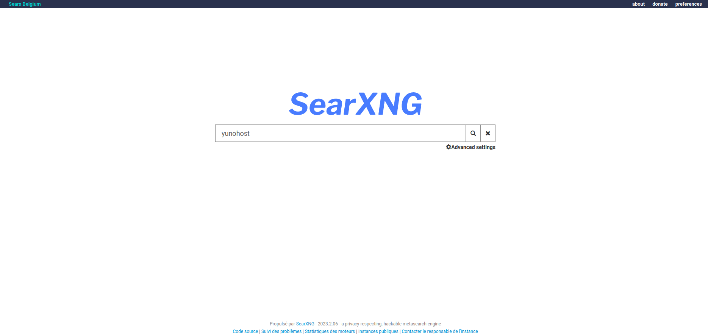

<!--
N.B.: This README was automatically generated by https://github.com/YunoHost/apps/tree/master/tools/README-generator
It shall NOT be edited by hand.
-->

# SearXNG pour YunoHost

[](https://dash.yunohost.org/appci/app/searxng)  

[](https://install-app.yunohost.org/?app=searxng)

*[Read this readme in english.](./README.md)*

> *Ce package vous permet d’installer SearXNG rapidement et simplement sur un serveur YunoHost.
Si vous n’avez pas YunoHost, regardez [ici](https://yunohost.org/#/install) pour savoir comment l’installer et en profiter.*

## Vue d’ensemble

SearxXNG is a free internet metasearch engine which aggregates results from more than 70 search services. Users are neither tracked nor profiled.


**Version incluse :** 2023.04.21.11.39.18~ynh1

**Démo :** https://searx.be/

## Captures d’écran



## Avertissements / informations importantes

Please note that this application is a rolling-release (i.e. each commit is a release) and thus is updated very regularly. People not updating frequently may encounter some bugs or disruptions due to the very nature of this software.

## Documentations et ressources

* Site officiel de l’app : <https://docs.searxng.org/>
* Documentation officielle utilisateur : <https://docs.searxng.org/user/>
* Documentation officielle de l’admin : <https://docs.searxng.org/admin/>
* Dépôt de code officiel de l’app : <https://github.com/searxng/searxng>
* Documentation YunoHost pour cette app : <https://yunohost.org/app_searxng>
* Signaler un bug : <https://github.com/YunoHost-Apps/searxng_ynh/issues>

## Informations pour les développeurs

Merci de faire vos pull request sur la [branche testing](https://github.com/YunoHost-Apps/searxng_ynh/tree/testing).

Pour essayer la branche testing, procédez comme suit.

``` bash
sudo yunohost app install https://github.com/YunoHost-Apps/searxng_ynh/tree/testing --debug
ou
sudo yunohost app upgrade searxng -u https://github.com/YunoHost-Apps/searxng_ynh/tree/testing --debug
```

**Plus d’infos sur le packaging d’applications :** <https://yunohost.org/packaging_apps>